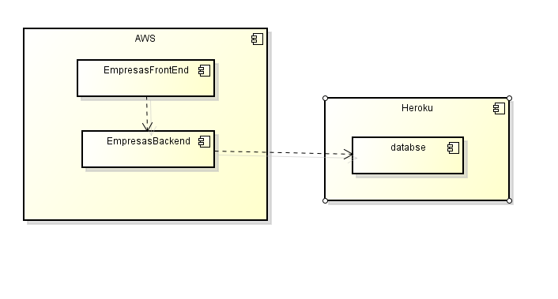
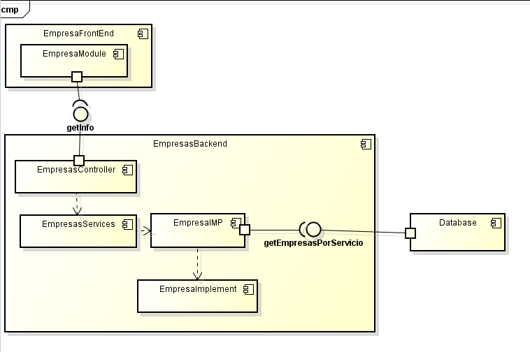

# Proyecto arep
## Integrantes 🔧
* Daniel Felipe Rodriguez Villalba
* Andrés Rodríguez del toro 
## link proyecto
http://52.234.134.249:8080/
## Crecimiento de empresas colombianas de consultoría en Colombia
## Descripción general
Al momento de montar su propia empresa, es importante planear y organizar su funcionamiento de forma detallada. Qué servicio o producto se va a ofrecer, a qué segmento del público es el que queremos satisfacer, medios de distribución, publicidad y muchos más factores a tener en cuenta. Las empresas con más años de experiencia suelen tener ya este plan bien diseñado, sin embargo las nuevas pueden tener algunos factores de estos sin contemplar y pueden llevar a la empresa a un fracaso inminente. Incluso las empresas que ofrecen consultorías y soluciones TI a otras sufren de esto. Estas últimas específicamente buscan prestar servicios profesionales para facilitar asesorías en la definición de modelos de negocio que involucren propuestas de valor y estrategias innovadoras que solucionen necesidades o problemáticas de diferentes tipos de mercados de forma sostenible y en el desarrollo de la estrategia empresarial de la empresa en el sector de telecomunicaciones. Con esto en mente decidimos estudiar un grupo de empresas pequeñas, medianas y grandes y observar su arquitectura, para así poder identificar de forma aproximada el funcionamiento de las empresas grandes y poder proponer a las empresas medianas y pequeñas estrategias para el éxito de estas. 
## Investigación 
Para enfocarnos más en un mercado local decidimos realizar una investigación de diferentes empresas, específicamente empresas consultoras que brindan servicios de asesorias y soluciones TI en Colombia, además de algunas peculiaridades de estas como en qué plataforma están montados sus servicios, sus ingresos promedio e información peculiar de cada una de estas.
Decidimos realizar una aplicación que ayude a graficar los datos obtenidos en la investigación, tales como los servicios web en los cuales están ubicadas las páginas de las empresas antes mencionadas,  de esta forma buscamos facilitar la representación del estado actual del mercado y brindar soluciones a las consultoras pequeñas para que puedan aspirar a tener un crecimiento sostenible. 
## arquitectura de la aplicación
## Diagrama de  despliegue

## Diagrama de componentes

